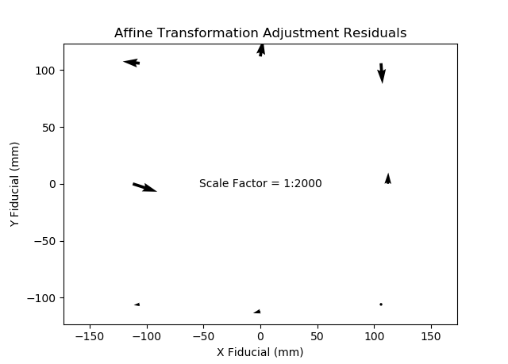

# Tasks

## Similarity Transformation (dec_1_027)
```
LINEAR PARAMETERS
a = 0.0119003453
b = -0.0000008202
delta x = -122.0211 mm
delta y = 123.5194 mm

NON-LINEAR PARAMETERS
scale = 0.01190035
rotation = -0.0039 degrees

COORDINATES AND RESIDUALS IN FIDUCIAL SYSTEM (UNITS=mm)
  #         x    x residual         y    y residual
---  --------  ------------  --------  ------------
  1  -105.997       -0.0220  -105.995        0.0033
  2   106.004        0.0081   106.008       -0.0097
  3  -106.000        0.0075   106.009       -0.0080
  4   106.012        0.0093  -105.995        0.0124
  5  -112.000       -0.0095     0.007       -0.0139
  6   112.006        0.0085     0.007        0.0064
  7     0.005       -0.0007   112.007       -0.0036
  8     0.002       -0.0013  -111.998        0.0131

ROOT MEAN SQUARE ERRORS
RMSE x = 0.0104 mm
RMSE y = 0.0096 mm
```


## Affine Transformation (dec_1_027)
```
LINEAR PARAMETERS
a = 0.0118994263
b = 0.0000002998
c = -0.0000013405
d = 0.0119012647
delta x = -122.0170 mm
delta y = 123.5343 mm

NON-LINEAR PARAMETERS
scale x = 0.01189943
scale y = 0.01190126
rotation = -0.0065 degrees
non-orthogonality = -0.0050 degrees

COORDINATES AND RESIDUALS IN FIDUCIAL SYSTEM (UNITS=mm)
  #         x    x residual         y    y residual
---  --------  ------------  --------  ------------
  1  -105.997       -0.0092  -105.995       -0.0003
  2   106.004       -0.0047   106.008       -0.0062
  3  -106.000        0.0110   106.009        0.0048
  4   106.012        0.0058  -105.995       -0.0004
  5  -112.000       -0.0008     0.007       -0.0090
  6   112.006       -0.0001     0.007        0.0015
  7     0.005       -0.0056   112.007        0.0050
  8     0.002        0.0036  -111.998        0.0044

ROOT MEAN SQUARE ERRORS
RMSE x = 0.0062 mm
RMSE y = 0.0049 mm
```


## Projective Transformation (dec_1_027)
```
LINEAR PARAMETERS
a1 = 0.0118997330 (affine a)
a2 = 0.0000002998 (affine b)
a3 = -122.0214372821 (delta x)
b1 = -0.0000013405 (affine c)
b2 = 0.0119015714 (affine d)
b3 = 123.5344190674 (delta y)
c1 = -0.0000000017 (plane x coefficient)
c2 = -0.0000000042 (plane y coefficnet)

NON-LINEAR PARAMETERS
scale x = 0.01189973
scale y = 0.01190157
rotation = -0.0065 degrees
non-orthogonality = -0.0050 degrees

COORDINATES AND RESIDUALS IN FIDUCIAL SYSTEM (UNITS=mm)
  #         x    x residual         y    y residual
---  --------  ------------  --------  ------------
  1  -105.997       -0.0049  -105.995        0.0022
  2   106.004       -0.0004   106.008       -0.0037
  3  -106.000        0.0075   106.009        0.0041
  4   106.012        0.0022  -105.995       -0.0011
  5  -112.000       -0.0003     0.007       -0.0120
  6   112.006        0.0004     0.007       -0.0016
  7     0.005       -0.0069   112.007        0.0064
  8     0.002        0.0024  -111.998        0.0057

ROOT MEAN SQUARE ERRORS
RMSE x = 0.0042 mm
RMSE y = 0.0057 mm
```


## Similarity Transformation (dec_1_028)
```
LINEAR PARAMETERS
a = 0.0119005606
b = 0.0000079300
delta x = -122.1915 mm
delta y = 123.5077 mm

NON-LINEAR PARAMETERS
scale = 0.01190056
rotation = 0.0382 degrees

COORDINATES AND RESIDUALS IN FIDUCIAL SYSTEM (UNITS=mm)
  #         x    x residual         y    y residual
---  --------  ------------  --------  ------------
  1  -105.997       -0.0115  -105.995       -0.0008
  2   106.004        0.0095   106.008       -0.0086
  3  -106.000       -0.0070   106.009       -0.0081
  4   106.012       -0.0000  -105.995        0.0096
  5  -112.000        0.0063     0.007       -0.0084
  6   112.006        0.0046     0.007        0.0099
  7     0.005        0.0062   112.007        0.0029
  8     0.002       -0.0082  -111.998        0.0036

ROOT MEAN SQUARE ERRORS
RMSE x = 0.0074 mm
RMSE y = 0.0073 mm
```


## Affine Transformation (dec_1_028)
```
LINEAR PARAMETERS
a = 0.0119000883
b = -0.0000084564
c = 0.0000074035
d = 0.0119010331
delta x = -122.1921 mm
delta y = 123.5180 mm

NON-LINEAR PARAMETERS
scale x = 0.01190009
scale y = 0.01190104
rotation = 0.0356 degrees
non-orthogonality = -0.0051 degrees

COORDINATES AND RESIDUALS IN FIDUCIAL SYSTEM (UNITS=mm)
  #         x    x residual         y    y residual
---  --------  ------------  --------  ------------
  1  -105.997       -0.0026  -105.995       -0.0003
  2   106.004        0.0006   106.008       -0.0091
  3  -106.000       -0.0074   106.009        0.0008
  4   106.012        0.0005  -105.995        0.0007
  5  -112.000        0.0107     0.007       -0.0035
  6   112.006        0.0002     0.007        0.0050
  7     0.005        0.0012   112.007        0.0074
  8     0.002       -0.0032  -111.998       -0.0009

ROOT MEAN SQUARE ERRORS
RMSE x = 0.0049 mm
RMSE y = 0.0047 mm
```


## Projective Transformation (dec_1_028)
```
LINEAR PARAMETERS
a1 = 0.0118998130 (affine a)
a2 = -0.0000084563 (affine b)
a3 = -122.1903423329 (delta x)
b1 = 0.0000074033 (affine c)
b2 = 0.0119007578 (affine d)
b3 = 123.5157829666 (delta y)
c1 = -0.0000000014 (plane x coefficient)
c2 = 0.0000000008 (plane y coefficnet)

NON-LINEAR PARAMETERS
scale x = 0.01189982
scale y = 0.01190076
rotation = 0.0356 degrees
non-orthogonality = -0.0051 degrees

COORDINATES AND RESIDUALS IN FIDUCIAL SYSTEM (UNITS=mm)
  #         x    x residual         y    y residual
---  --------  ------------  --------  ------------
  1  -105.997       -0.0031  -105.995        0.0009
  2   106.004        0.0002   106.008       -0.0079
  3  -106.000       -0.0064   106.009       -0.0007
  4   106.012        0.0015  -105.995       -0.0008
  5  -112.000        0.0112     0.007       -0.0029
  6   112.006        0.0006     0.007        0.0056
  7     0.005        0.0002   112.007        0.0071
  8     0.002       -0.0043  -111.998       -0.0011

ROOT MEAN SQUARE ERRORS
RMSE x = 0.0050 mm
RMSE y = 0.0044 mm
```


# Questions
1. For each of the Tasks above, are there any noticeable patterns in the residuals for any of the transformations and for any of the images? <br>
_The similarity transform for dec_1_027 looks to have residuals pushing inward on the top and bottom and outward on the left and right, suggesting the need for unique scale factors in x and y (supplied in the affine transform). The x and y RMSEs are roughly half when using an affine transformation. The similarity transform residuals for dec_1_028 have an interesting symmetric quality (symmetric in diagonal quadrants) that may suggest a non-orthogonality component (supplied in the affine transform)._
2. Do the two images have comparable transformation parameters in each of the above tasks? If no, why would there be differences in the derived transformation values? <br>
_Scales (single in similarity, x and y in affine), translations, and non-orthogonality angles are comparable. Rotations are not. Neither are the plane parameters in the projective transforms. The rotations are likely not comparable because they depend on how the original image was scanned or placed on the comparator, and is thus unique to each image. The projective plane parameters are likely not comparable because they are so small and do not rise above the noise level._
3. Given the results from Tasks 1, 2 and 3, which transformation should be used for observations from this camera/comparator system? Justify your answer and explain your reasoning. <br>
_The affine is sufficient based on the consistency of the x and y scales and non-orthogonality angle for both images, coupled with the reduction by half in the x and y RMSEs from the similarity transform to the affine transform. Note that the RMSEs do not decrease when moving to the projective transform._